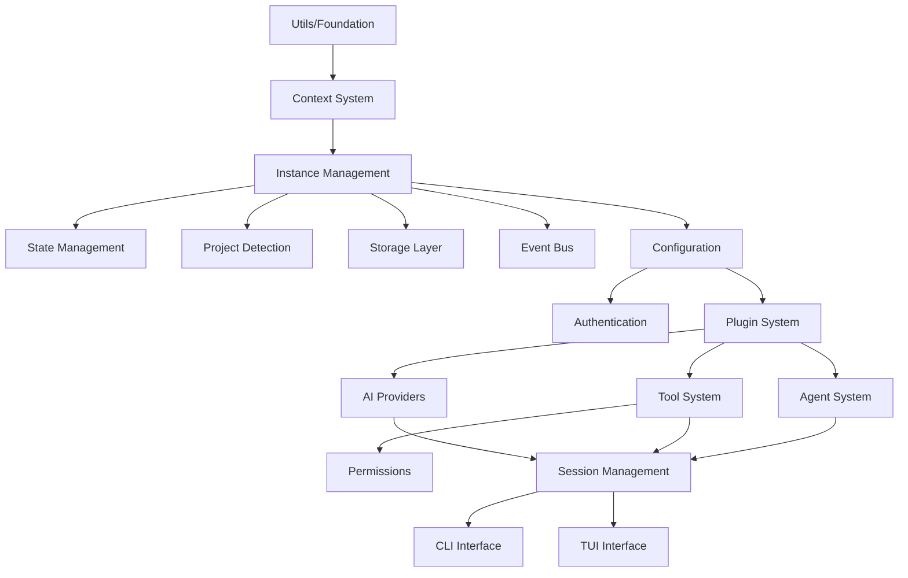

# Building OpenCode From Scratch

A comprehensive guide to understanding and rebuilding the OpenCode architecture, including dependencies, design patterns, and implementation order.

---

## Table of Contents

1. [Architecture Overview](#architecture-overview)
2. [Core Design Patterns](#core-design-patterns)
3. [Dependency Graph](#dependency-graph)
4. [Build Order Guide](#build-order-guide)
5. [Implementation Steps](#implementation-steps)
6. [Key Design Decisions](#key-design-decisions)
7. [Improvement Opportunities](#improvement-opportunities)
8. [Testing Strategy](#testing-strategy)

---

## Architecture Overview

OpenCode is built as a layered architecture with clear separation of concerns:

```
┌─────────────────────────────────────────┐
│         CLI & TUI Interface             │  <- User-facing layer
├─────────────────────────────────────────┤
│         Session Management              │  <- Business logic
├─────────────────────────────────────────┤
│    Tools │ Agents │ Providers │ Format │  <- Feature layer
├─────────────────────────────────────────┤
│   Config │ Plugin │ Auth │ Permission  │  <- Service layer
├─────────────────────────────────────────┤
│    Storage │ Bus │ LSP │ MCP │ IDE     │  <- Infrastructure
├─────────────────────────────────────────┤
│    Instance │ State │ Project          │  <- Core abstractions
├─────────────────────────────────────────┤
│    Context │ Log │ Error │ Utils       │  <- Foundation
└─────────────────────────────────────────┘
```

### Tech Stack & Frameworks

#### Core Runtime & Build Tools

| Category | Choice | Version | Purpose | Alternatives |
|----------|--------|---------|---------|--------------|
| **Runtime** | Bun | 1.3.2 | Fast JS/TS runtime with built-in bundler | Node.js + npm/yarn/pnpm |
| **Language** | TypeScript | 5.8.2 | Type safety and modern JS features | JavaScript, Flow, JSDoc |
| **Monorepo** | Turbo | 2.5.6 | Fast incremental builds, smart caching | Lerna, Nx, Rush, Bazel |
| **Package Manager** | Bun | 1.3.2 | Fast package installation | npm, yarn, pnpm |

#### CLI & Terminal UI

| Category | Choice | Version | Purpose | Alternatives |
|----------|--------|---------|---------|--------------|
| **CLI Framework** | Yargs | 18.0.0 | Command parsing, help generation | Commander.js, Oclif, Meow, Inquirer |
| **TUI Framework** | OpenTUI | 0.1.47 | Terminal UI components | Blessed, Ink (React), Vorpal |
| **UI Library** | Solid.js | 1.9.9 | Reactive UI with fine-grained updates | React, Vue, Svelte, Preact |
| **Prompts** | @clack/prompts | 1.0.0-alpha.1 | Beautiful CLI prompts | Inquirer.js, Prompts, Enquirer |

#### AI & LLM Integration

| Category | Choice | Version | Purpose | Alternatives |
|----------|--------|---------|---------|--------------|
| **AI SDK** | Vercel AI SDK | 5.0.8 | Unified LLM interface, streaming | LangChain, Direct provider SDKs |
| **AWS AI** | @ai-sdk/amazon-bedrock | 2.2.10 | Amazon Bedrock integration | AWS SDK direct |
| **Google AI** | @ai-sdk/google-vertex | 3.0.16 | Google Vertex AI integration | Google Cloud SDK direct |

#### Protocols & Communication

| Category | Choice | Version | Purpose | Alternatives |
|----------|--------|---------|---------|--------------|
| **MCP** | @modelcontextprotocol/sdk | 1.15.1 | Model Context Protocol | Custom implementation |
| **ACP** | @agentclientprotocol/sdk | 0.5.1 | Agent Client Protocol | Custom agent protocol |
| **LSP** | vscode-jsonrpc | 8.2.1 | Language Server Protocol | jayson, node-json-rpc |
| **HTTP Framework** | Hono | 4.7.10 | Lightweight web server | Express, Fastify, Koa |

#### Storage & Database

| Category | Choice | Version | Purpose | Alternatives |
|----------|--------|---------|---------|--------------|
| **Database** | SQLite | Built-in | Local data storage | PostgreSQL, MySQL, DuckDB |
| **Future Embeddings** | sqlite-vec | Planned | Vector similarity search | pgvector, Pinecone, Weaviate |

#### Validation & Data

| Category | Choice | Version | Purpose | Alternatives |
|----------|--------|---------|---------|--------------|
| **Schema Validation** | Zod | 4.1.8 | Runtime validation with TS inference | Yup, Joi, io-ts, Superstruct |
| **Functional Utils** | Remeda | 2.26.0 | FP utilities, TS-first | Lodash, Ramda, Rambda |
| **Unique IDs** | ULID | 3.0.1 | Sortable, timestamp-based IDs | UUID, nanoid, cuid |
| **Fuzzy Search** | Fuzzysort | 3.1.0 | Fast fuzzy string matching | fuse.js, fuzzy, string-similarity |

#### File & Code Processing

| Category | Choice | Version | Purpose | Alternatives |
|----------|--------|---------|---------|--------------|
| **File Watching** | @parcel/watcher | 2.5.1 | Fast FS watching | Chokidar, node-watch, watchpack |
| **Code Parsing** | tree-sitter | 0.25.10 | Incremental parsing | Acorn, Babel parser, regex |
| **HTML→Markdown** | Turndown | 7.2.0 | Convert HTML to Markdown | html-to-markdown, showdown |
| **JSONC Parser** | jsonc-parser | 3.3.1 | Parse JSON with comments | JSON5, strip-json-comments |
| **Diff Algorithm** | Diff | 8.0.2 | Text difference calculation | jsdiff, diff-match-patch |

#### Development Tools

| Category | Choice | Version | Purpose | Alternatives |
|----------|--------|---------|---------|--------------|
| **Formatter** | Prettier | 3.6.2 | Code formatting | ESLint --fix, dprint |
| **Git Hooks** | Husky | 9.1.7 | Pre-commit/push hooks | simple-git-hooks, lint-staged |
| **Testing** | Bun Test | Built-in | Unit testing | Jest, Vitest, Mocha |

#### GitHub & Auth

| Category | Choice | Version | Purpose | Alternatives |
|----------|--------|---------|---------|--------------|
| **GitHub API** | @octokit/rest | 22.0.0 | GitHub REST API | Direct API calls |
| **GitHub GraphQL** | @octokit/graphql | 9.0.2 | GitHub GraphQL API | Apollo Client, urql |
| **Authentication** | @openauthjs/openauth | 0.0.0-* | Multi-provider auth | Auth0, Clerk, NextAuth |

### Key Framework Decisions & Rationale

#### Why Bun over Node.js?

**Chosen for:**
- 10-100x faster startup time
- Native TypeScript execution (no compilation step)
- Built-in bundler and test runner
- Modern Web APIs out of the box
- SQLite built-in

**Trade-offs:**
- ✅ Significantly faster development cycle
- ✅ Single tool instead of Node + npm + bundler + test runner
- ❌ Smaller ecosystem (though Node compatibility is good)
- ❌ Newer, less battle-tested in production

#### Why Solid.js over React for TUI?

**Chosen for:**
- Fine-grained reactivity (perfect for terminal updates)
- No virtual DOM overhead (direct updates)
- Smaller bundle size (7kb vs React's 45kb)
- Better performance for frequent updates

**Trade-offs:**
- ✅ Superior performance for reactive TUI
- ✅ Simpler mental model (no hooks rules)
- ❌ Smaller ecosystem than React
- ❌ Less familiar to most developers

#### Why Vercel AI SDK over LangChain?

**Chosen for:**
- Simpler, more focused API
- Better streaming support
- Framework agnostic
- Lighter weight
- Direct provider integration

**Trade-offs:**
- ✅ Easier to understand and debug
- ✅ Better TypeScript support
- ❌ Less features than LangChain
- ❌ Fewer pre-built chains/agents

#### Why Hono over Express?

**Chosen for:**
- Built for edge/modern runtimes
- First-class TypeScript
- Lighter weight (no legacy baggage)
- Works perfectly with Bun

**Trade-offs:**
- ✅ Modern, clean API
- ✅ Better performance
- ❌ Smaller ecosystem
- ❌ Less middleware available

#### Why Zod over other validators?

**Chosen for:**
- TypeScript inference from schemas
- Composable schemas
- Great error messages
- Active development

**Trade-offs:**
- ✅ Best TypeScript integration
- ✅ Runtime and compile-time safety
- ❌ Slightly larger bundle than Yup
- ❌ More verbose than some alternatives

---

## Core Design Patterns

### 1. Instance/Context Pattern (Most Important!)

The cornerstone of OpenCode's architecture. Provides project isolation and context propagation.

```typescript
// Every operation runs within an Instance context
await Instance.provide({
  directory: "/path/to/project",
  fn: async () => {
    // All code here has access to Instance.directory, Instance.project, etc.
    const config = await Config.load() // Automatically uses Instance context
  }
})
```

**Why it matters:**
- Enables multi-project support
- Provides automatic cleanup
- Prevents state leakage between projects
- Makes testing deterministic

### 2. Lazy State Pattern

Components initialize state only when needed, reducing startup time.

```typescript
const state = Instance.state(async () => {
  // Expensive initialization only happens once per instance
  return await loadExpensiveResource()
})

// Later...
const resource = await state() // Cached after first call
```

### 3. Event Bus Pattern

Decoupled communication between components.

```typescript
// Define typed event
const ConfigUpdated = Bus.event("config.updated", z.object({
  path: z.string()
}))

// Subscribe
Bus.on(ConfigUpdated, (data) => {
  console.log(`Config updated at ${data.path}`)
})

// Emit
Bus.emit(ConfigUpdated, { path: "/home/user/project" })
```

### 4. Registry Pattern

Dynamic registration of tools, providers, and plugins.

```typescript
ToolRegistry.register("bash", BashTool)
const tool = await ToolRegistry.get("bash")
```

### 5. Permission System

Fine-grained control over what operations are allowed.

```typescript
await Permission.check("file.write", { path: "/etc/passwd" }) // Throws if denied
```

---

## Dependency Graph



### Critical Dependencies

1. **Instance depends on**: Context, Project, State
2. **Storage depends on**: Instance (for project directory)
3. **Config depends on**: Instance, Storage, Auth
4. **Session depends on**: Almost everything
5. **CLI/TUI depends on**: Session

---

## Build Order Guide

### Phase 1: Foundation (Week 1)

Start with zero dependencies, pure utilities.

```bash
packages/opencode/src/util/
├── error.ts       # Named errors with Zod
├── log.ts         # Logging system
├── context.ts     # AsyncLocalStorage wrapper
├── lazy.ts        # Lazy initialization
├── defer.ts       # Deferred promises
├── queue.ts       # Async queue
├── lock.ts        # Mutex/semaphore
├── timeout.ts     # Timeout utilities
└── filesystem.ts  # File system helpers
```

### Phase 2: Core Abstractions (Week 1-2)

Build the Instance/State system that everything else depends on.

```bash
packages/opencode/src/
├── global/        # Global paths and constants
└── project/
    ├── state.ts   # State management
    ├── instance.ts # Instance context
    └── project.ts  # Project detection (Git)
```

### Phase 3: Infrastructure (Week 2-3)

Add persistence and communication layers.

```bash
packages/opencode/src/
├── bus/           # Event system
│   ├── index.ts   # Instance-scoped bus
│   └── global.ts  # Global bus
├── storage/       # Data persistence
│   ├── backend.ts # Abstract interface
│   ├── storage.ts # Main storage API
│   └── multi-sqlite-backend.ts
└── auth/          # Authentication
```

### Phase 4: Service Layer (Week 3-4)

Configuration and plugin systems.

```bash
packages/opencode/src/
├── config/        # Configuration loading
├── plugin/        # Plugin system
└── permission/    # Permission checks
```

### Phase 5: Features (Week 4-5)

AI providers, tools, and agents.

```bash
packages/opencode/src/
├── provider/      # AI model providers
├── tool/          # Tool implementations
│   ├── bash.ts
│   ├── edit.ts
│   ├── read.ts
│   └── registry.ts
└── agent/         # Agent configurations
```

### Phase 6: Business Logic (Week 5-6)

Core session management.

```bash
packages/opencode/src/session/
├── index.ts       # Session lifecycle
├── message-v2.ts  # Message handling
├── processor.ts   # AI processing
├── prompt.ts      # Prompt construction
└── system.ts      # System prompts
```

### Phase 7: User Interface (Week 6-7)

CLI and TUI.

```bash
packages/opencode/src/cli/
├── cmd/           # CLI commands
│   ├── run.ts
│   ├── serve.ts
│   └── tui/       # TUI components
└── ui.ts          # UI utilities
```

---

## Implementation Steps

### Step 1: Project Setup

```bash
# Initialize monorepo
mkdir opencode-new && cd opencode-new
bun init

# Setup workspace structure
mkdir -p packages/{opencode,sdk,plugin,script}

# Install core dependencies
bun add -d typescript turbo prettier husky

# Install runtime dependencies for main package
cd packages/opencode
bun add yargs @opentui/core @opentui/solid solid-js
bun add ai @ai-sdk/openai @ai-sdk/anthropic  
bun add hono @hono/zod-validator zod
bun add @modelcontextprotocol/sdk @agentclientprotocol/sdk
bun add vscode-jsonrpc vscode-languageserver-types
bun add remeda fuzzysort ulid diff
bun add @parcel/watcher clipboardy open

# Configure TypeScript
cat > tsconfig.json << 'EOF'
{
  "compilerOptions": {
    "target": "ES2022",
    "module": "ESNext",
    "moduleResolution": "bundler",
    "strict": true,
    "esModuleInterop": true,
    "skipLibCheck": true,
    "forceConsistentCasingInFileNames": true,
    "resolveJsonModule": true,
    "paths": {
      "@/*": ["./src/*"]
    }
  }
}
EOF

# Setup Turbo for builds
bun add -d turbo
```

### Step 2: Foundation Layer

```typescript
// src/util/context.ts
import { AsyncLocalStorage } from "async_hooks"

export function createContext<T>(name: string) {
  const storage = new AsyncLocalStorage<T>()
  
  return {
    provide<R>(value: T, fn: () => R): R {
      return storage.run(value, fn)
    },
    use(): T {
      const value = storage.getStore()
      if (!value) throw new Error(`No context for ${name}`)
      return value
    }
  }
}
```

### Step 3: Instance System

```typescript
// src/project/instance.ts
import { createContext } from "../util/context"

interface InstanceContext {
  directory: string
  project: ProjectInfo
}

const context = createContext<InstanceContext>("instance")

export const Instance = {
  async provide<R>(opts: {
    directory: string
    fn: () => R
  }): Promise<R> {
    const project = await detectProject(opts.directory)
    return context.provide(
      { directory: opts.directory, project },
      opts.fn
    )
  },
  
  get directory() {
    return context.use().directory
  },
  
  state<S>(init: () => S): () => S {
    // Lazy state implementation
  }
}
```

### Step 4: Storage Layer

```typescript
// src/storage/storage.ts
export namespace Storage {
  const state = Instance.state(async () => {
    const dir = path.join(Instance.directory, ".opencode")
    const backend = new MultiSqliteBackend(dir)
    return { backend }
  })
  
  export async function read<T>(key: string[]): Promise<T> {
    const { backend } = await state()
    return backend.read(key)
  }
  
  // write, update, remove, list...
}
```

### Step 5: Event Bus

```typescript
// src/bus/index.ts
export namespace Bus {
  const state = Instance.state(() => new EventEmitter())
  
  export function event<T>(name: string, schema: z.ZodSchema<T>) {
    return { name, schema }
  }
  
  export function on<T>(event: Event<T>, handler: (data: T) => void) {
    const bus = state()
    bus.on(event.name, handler)
  }
  
  export function emit<T>(event: Event<T>, data: T) {
    const bus = state()
    bus.emit(event.name, event.schema.parse(data))
  }
}
```

### Step 6: Configuration

```typescript
// src/config/config.ts
export namespace Config {
  const state = Instance.state(async () => {
    // Load from multiple sources
    const global = await loadGlobal()
    const project = await loadProject()
    const local = await loadLocal()
    
    // Merge with precedence
    return merge(global, project, local)
  })
  
  export async function get() {
    return await state()
  }
}
```

### Step 7: Session Management

```typescript
// src/session/index.ts
export class Session {
  constructor(
    private id: string,
    private config: Config
  ) {}
  
  async send(message: string) {
    // Process user message
    const response = await this.processor.process(message)
    await Storage.write(["message", this.id, messageId], response)
    return response
  }
}
```

### Step 8: CLI Interface

```typescript
// src/index.ts
import yargs from "yargs"

const cli = yargs(process.argv.slice(2))
  .command({
    command: "chat [message]",
    handler: async (args) => {
      await Instance.provide({
        directory: process.cwd(),
        fn: async () => {
          const session = await Session.current()
          const response = await session.send(args.message)
          console.log(response)
        }
      })
    }
  })
  
await cli.parse()
```

---

## Key Design Decisions

### 1. Per-Project Storage

**Decision**: Store all data in `{project}/.opencode/` instead of global `~/.opencode/`

**Rationale**:
- Projects are self-contained
- Easy to share/backup/delete
- No conflicts between projects
- Natural for version control

**Trade-offs**:
- ✅ Better isolation
- ✅ Easier collaboration
- ❌ Some duplication across projects
- ❌ Need to handle `.gitignore`

### 2. Instance/Context Pattern

**Decision**: Use AsyncLocalStorage for context propagation

**Rationale**:
- Automatic context in async operations
- No need to pass context explicitly
- Clean API surface
- Works with concurrent operations

**Trade-offs**:
- ✅ Cleaner code
- ✅ Automatic propagation
- ❌ Harder to debug
- ❌ Performance overhead

### 3. SQLite Over JSON

**Decision**: Use SQLite databases instead of JSON files

**Rationale**:
- Better performance at scale
- Atomic operations
- Future embedding support (sqlite-vec)
- Single file per session vs thousands of JSON files

**Trade-offs**:
- ✅ Much faster queries
- ✅ Better concurrency
- ❌ Binary format (not human-readable)
- ❌ Requires SQLite dependency

### 4. Lazy State Management

**Decision**: Initialize expensive resources only when needed

**Rationale**:
- Faster startup time
- Lower memory usage
- Resources only loaded for used features

**Trade-offs**:
- ✅ Better performance
- ✅ Lower resource usage
- ❌ More complex code
- ❌ Potential for initialization races

### 5. Solid.js for TUI

**Decision**: Use Solid.js reactive framework for terminal UI

**Rationale**:
- Fine-grained reactivity perfect for TUI updates
- Small bundle size
- Good TypeScript support
- Familiar component model

**Trade-offs**:
- ✅ Excellent performance
- ✅ Reactive updates
- ❌ Smaller ecosystem than React
- ❌ Learning curve for React developers

---

## Framework Migration Guide

### If You Want Different Frameworks

While OpenCode uses specific frameworks, the architecture is flexible enough to support alternatives. Here's how to migrate to different choices:

#### Migrating Runtime: Bun → Node.js

```bash
# Replace Bun-specific APIs
- Bun.file() → fs.promises.readFile()
- Bun.write() → fs.promises.writeFile()
- Bun.spawn() → child_process.spawn()
- Bun test → Jest/Vitest
- SQLite built-in → better-sqlite3/node-sqlite3

# Update package.json scripts
- "bun run" → "node"
- "bun test" → "jest" or "vitest"
```

#### Migrating UI: Solid.js → React

```typescript
// Solid.js (current)
import { createSignal, onMount } from "solid-js"
function Component() {
  const [count, setCount] = createSignal(0)
  onMount(() => console.log("mounted"))
  return <div>{count()}</div>
}

// React equivalent
import { useState, useEffect } from "react"
function Component() {
  const [count, setCount] = useState(0)
  useEffect(() => console.log("mounted"), [])
  return <div>{count}</div>
}
```

#### Migrating CLI: Yargs → Commander.js

```typescript
// Yargs (current)
yargs(argv)
  .command({
    command: "run <file>",
    describe: "Run a file",
    handler: (args) => { }
  })

// Commander equivalent
program
  .command("run <file>")
  .description("Run a file")
  .action((file) => { })
```

#### Migrating AI SDK: Vercel AI → LangChain

```typescript
// Vercel AI SDK (current)
import { openai } from "@ai-sdk/openai"
const result = await generateText({
  model: openai("gpt-4"),
  prompt: "Hello"
})

// LangChain equivalent
import { ChatOpenAI } from "@langchain/openai"
const model = new ChatOpenAI({ model: "gpt-4" })
const result = await model.invoke("Hello")
```

#### Migrating Validation: Zod → Yup

```typescript
// Zod (current)
const schema = z.object({
  name: z.string(),
  age: z.number().min(0)
})

// Yup equivalent
const schema = yup.object({
  name: yup.string().required(),
  age: yup.number().min(0).required()
})
```

#### Migrating HTTP: Hono → Express

```typescript
// Hono (current)
import { Hono } from "hono"
const app = new Hono()
app.get("/", (c) => c.json({ message: "Hello" }))

// Express equivalent
import express from "express"
const app = express()
app.get("/", (req, res) => res.json({ message: "Hello" }))
```

### Framework Selection Criteria

When choosing frameworks for your implementation, consider:

#### Performance Requirements
- **Real-time updates**: Solid.js, Svelte > React, Vue
- **Startup time**: Bun > Node.js > Deno
- **Memory usage**: Hono > Express > Nest.js

#### Developer Experience
- **Team familiarity**: React > Solid.js
- **Ecosystem size**: Node.js > Bun > Deno
- **Type safety**: Zod > Yup > Joi

#### Production Considerations
- **Stability**: Node.js > Bun (for now)
- **Monitoring**: Express ecosystem > Hono
- **Deploy targets**: Node.js (anywhere) > Bun (limited)

#### Maintenance
- **Community**: React, Express (huge) > Solid.js, Hono (growing)
- **Documentation**: Established frameworks > New ones
- **Long-term support**: Node.js LTS > Bun (evolving)

---

## Improvement Opportunities

### 1. Simplify State Management

**Current Issue**: Three overlapping systems (Instance, State, Context)

**Improvement**:
```typescript
// Unified state system
export const AppState = {
  instance: createState<Instance>(),
  config: createState<Config>(),
  session: createState<Session>(),
}

// Usage
AppState.instance.use().directory
```

### 2. Better Storage Abstraction

**Current Issue**: Storage backends are tightly coupled to implementation

**Improvement**:
```typescript
interface StorageAdapter {
  get(key: string): Promise<unknown>
  set(key: string, value: unknown): Promise<void>
  delete(key: string): Promise<void>
  list(prefix: string): Promise<string[]>
}

// Implementations
class SqliteAdapter implements StorageAdapter { }
class RedisAdapter implements StorageAdapter { }
class S3Adapter implements StorageAdapter { }
```

### 3. Simplify Provider Loading

**Current Issue**: Complex dynamic loading with multiple config sources

**Improvement**:
```typescript
// Single source of truth for providers
const providers = {
  openai: () => import("./providers/openai"),
  anthropic: () => import("./providers/anthropic"),
  local: () => import("./providers/local"),
}

// Simple loading
const provider = await providers[name]()
```

### 4. Type-Safe Event Bus

**Current Issue**: Events use strings, potential for typos

**Improvement**:
```typescript
// Type-safe events
const events = createEventBus({
  configUpdated: z.object({ path: z.string() }),
  sessionStarted: z.object({ id: z.string() }),
})

// Autocomplete and type checking
events.on("configUpdated", (data) => {
  // data is typed as { path: string }
})
```

### 5. Plugin System Improvements

**Current Issue**: Plugins need complex registration

**Improvement**:
```typescript
// Plugin manifest
interface PluginManifest {
  name: string
  version: string
  exports: {
    tools?: Tool[]
    providers?: Provider[]
    commands?: Command[]
  }
}

// Auto-discovery
const plugins = await discoverPlugins("./plugins")
plugins.forEach(p => registerPlugin(p))
```

### 6. Better Error Recovery

**Current Issue**: Errors can leave system in inconsistent state

**Improvement**:
```typescript
// Transactional operations
await Transaction.run(async (tx) => {
  await tx.storage.write(key1, value1)
  await tx.storage.write(key2, value2)
  // Automatically rolled back on error
})
```

### 7. Streaming Improvements

**Current Issue**: Complex streaming implementation

**Improvement**:
```typescript
// Unified streaming interface
class StreamProcessor {
  async *process(input: AsyncIterable<Chunk>) {
    for await (const chunk of input) {
      yield await this.transform(chunk)
    }
  }
}
```

---

## Testing Strategy

### Unit Testing

Test individual components in isolation.

```typescript
// test/util/context.test.ts
test("context propagates through async operations", async () => {
  const ctx = createContext<number>("test")
  
  const result = await ctx.provide(42, async () => {
    await sleep(10)
    return ctx.use()
  })
  
  expect(result).toBe(42)
})
```

### Integration Testing

Test component interactions.

```typescript
// test/storage/storage.test.ts
test("storage persists across instance restarts", async () => {
  const dir = await tmpdir()
  
  // First instance
  await Instance.provide({ directory: dir, fn: async () => {
    await Storage.write(["test"], { value: 42 })
  }})
  
  // Second instance
  await Instance.provide({ directory: dir, fn: async () => {
    const data = await Storage.read(["test"])
    expect(data.value).toBe(42)
  }})
})
```

### End-to-End Testing

Test complete workflows.

```typescript
// test/e2e/session.test.ts
test("complete chat session", async () => {
  await Instance.provide({ directory: tmpdir(), fn: async () => {
    const session = new Session()
    const response = await session.send("Hello")
    expect(response).toContain("Hi")
  }})
})
```

### Performance Testing

Ensure system meets performance requirements.

```typescript
// test/perf/storage.bench.ts
bench("storage write performance", async () => {
  for (let i = 0; i < 1000; i++) {
    await Storage.write(["test", String(i)], { data: "x".repeat(1000) })
  }
})
```

---

## Project Timeline

### Week 1: Foundation
- Set up monorepo structure
- Implement core utilities
- Create context system
- Add logging and errors

### Week 2: Core Systems  
- Build Instance/State management
- Add project detection
- Implement storage layer
- Create event bus

### Week 3: Services
- Configuration system
- Authentication
- Permission system
- Plugin architecture

### Week 4: Features
- AI provider integration
- Tool implementations
- Agent system
- Format/LSP/MCP integration

### Week 5: Business Logic
- Session management
- Message processing
- Prompt construction
- System prompts

### Week 6: User Interface
- CLI commands
- TUI components
- Theme system
- Keybind management

### Week 7: Polish
- Testing
- Documentation
- Performance optimization
- Error handling

---

## Quick Reference: Essential Dependencies

### Minimum Required for MVP

```json
{
  "dependencies": {
    // Core
    "yargs": "^18.0.0",        // CLI framework
    "solid-js": "^1.9.9",       // UI reactivity
    "zod": "^4.1.8",           // Validation
    
    // AI
    "ai": "^5.0.8",            // AI SDK
    "@ai-sdk/openai": "latest", // OpenAI provider
    
    // Storage
    "better-sqlite3": "*",      // If using Node.js
    
    // Utils
    "ulid": "^3.0.1",          // ID generation
    "remeda": "^2.26.0"        // FP utilities
  },
  "devDependencies": {
    "typescript": "^5.8.2",
    "turbo": "^2.5.6"
  }
}
```

### Dependencies by Feature

| Feature | Required Dependencies |
|---------|----------------------|
| **Basic CLI** | yargs |
| **TUI** | @opentui/core, @opentui/solid, solid-js |
| **AI Chat** | ai, @ai-sdk/* providers |
| **Storage** | SQLite (built-in with Bun) |
| **Config** | zod, jsonc-parser |
| **Tools** | @parcel/watcher (file), tree-sitter (code) |
| **GitHub** | @octokit/rest, @octokit/graphql |
| **Auth** | @openauthjs/openauth |
| **MCP/ACP** | @modelcontextprotocol/sdk, @agentclientprotocol/sdk |

### Version Compatibility Matrix

| Dependency | Min Version | Max Tested | Breaking Changes |
|------------|------------|------------|------------------|
| Bun | 1.3.0 | 1.3.3 | None |
| TypeScript | 5.0.0 | 5.8.2 | None |
| Solid.js | 1.8.0 | 1.9.9 | Minor API changes |
| Vercel AI SDK | 4.0.0 | 5.0.8 | v4→v5 major changes |
| Zod | 3.22.0 | 4.1.8 | v3→v4 method renames |

## Summary

Building OpenCode from scratch requires careful attention to the layered architecture and dependency management. The Instance/Context pattern is the cornerstone that enables multi-project support and proper isolation. 

**Key takeaways:**

1. **Start with foundations** - Utils and context system first
2. **Build incrementally** - Each layer depends only on layers below
3. **Test as you go** - Unit tests for each component
4. **Focus on the Instance pattern** - It's the key to everything
5. **Keep it simple** - Many current complexities can be simplified

The architecture is sound but has grown organically. A rebuild would be an opportunity to simplify state management, improve type safety, and create cleaner abstractions while maintaining the core strengths of project isolation and extensibility.

**Estimated effort**: 6-7 weeks for a small team, 10-12 weeks for solo developer

**Critical success factors:**
- Understanding the Instance/Context pattern
- Maintaining clean layer separation  
- Comprehensive testing at each layer
- Gradual migration strategy if replacing existing system